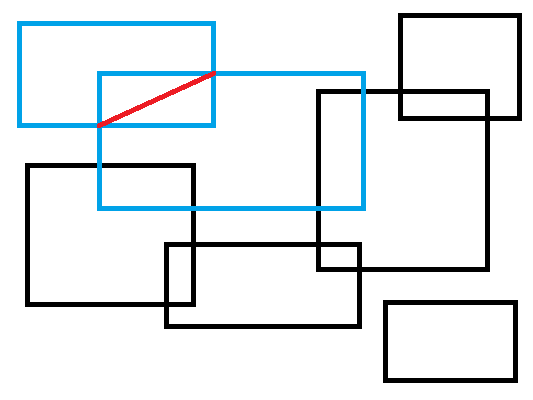

# Геометрический проект по информатике

Сырцов Степан, 10-1

## Условие задачи

На плоскости задано множество прямоугольников. Найти такую пару пересекающихся прямоугольников, что длина отрезка, проведенного от одной точки пересечения этих двух прямоугольников до другой, максимальна. Если прямоугольники имеют более двух точек пересечения, выбирать среди них такую пару, расстояние между которыми максимально. В качестве ответа: выделить эту пару прямоугольников, нарисовать отрезок между найденными точками пересечения.

